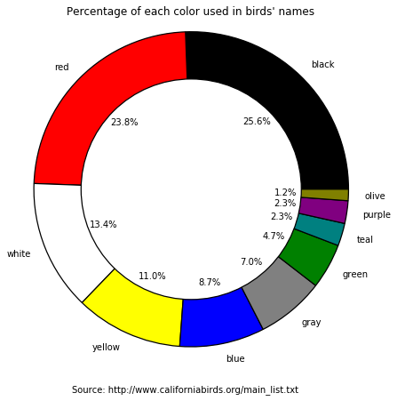

```python
import operator
import requests
from collections import defaultdict
import matplotlib.pyplot as plt
```


```python
# Getting the list of birds:
page = requests.get('http://www.californiabirds.org/main_list.txt')
birds_text = page.text
birds_list = birds_text.split('\n')
```


```python
# Cleaning the list of birds:
clean_birds = []

for bird in birds_list:
    if bird.find('(') > -1:
        bird = bird[0:bird.find('(')].rstrip()
    if len(bird) - len(bird.lstrip()) == 2:
        clean_birds = clean_birds + [bird.lstrip().lower()]
sorted(set(clean_birds))
```


    ["abert's towhee",
     'acorn woodpecker',
     'alder flycatcher',
     "allen's hummingbird",
     'american avocet',
     'american bittern',
     'american black duck',
     'american coot',
     'american crow',
     'american dipper',
     'american golden-plover',
     'american goldfinch',
     'american kestrel',
     'american oystercatcher',
     'american pipit',
     'american redstart',
     'american robin',
     'american tree sparrow',
     'american white pelican',
     'american wigeon',
     'american woodcock',
     'ancient murrelet',
     'anhinga',
     "anna's hummingbird",
     'arctic loon',
     'arctic tern',
     'arctic/kamchatka leaf warbler',
     'ash-throated flycatcher',
     'ashy storm-petrel',
     'baikal teal',
     "baird's sandpiper",
     "baird's sparrow",
     'bald eagle',
     'baltimore oriole',
     'band-tailed pigeon',
     'bank swallow',
     'bar-tailed godwit',
     'barn owl',
     'barn swallow',
     'barred owl',
     "barrow's goldeneye",
     'bay-breasted warbler',
     "belcher's gull",
     "bell's sparrow",
     "bell's vireo",
     'belted kingfisher',
     "bendire's thrasher",
     "bewick's wren",
     'black oystercatcher',
     'black phoebe',
     'black rail',
     'black rosy-finch',
     'black scoter',
     'black skimmer',
     'black storm-petrel',
     'black swift',
     'black tern',
     'black turnstone',
     'black vulture',
     'black-and-white warbler',
     'black-backed woodpecker',
     'black-bellied plover',
     'black-bellied whistling-duck',
     'black-billed cuckoo',
     'black-billed magpie',
     'black-capped chickadee',
     'black-chinned hummingbird',
     'black-chinned sparrow',
     'black-crowned night-heron',
     'black-footed albatross',
     'black-headed grosbeak',
     'black-headed gull',
     'black-legged kittiwake',
     'black-necked stilt',
     'black-tailed gnatcatcher',
     'black-tailed gull',
     'black-throated blue warbler',
     'black-throated gray warbler',
     'black-throated green warbler',
     'black-throated sparrow',
     'black-vented shearwater',
     'blackburnian warbler',
     'blackpoll warbler',
     'blue grosbeak',
     'blue jay',
     'blue-footed booby',
     'blue-gray gnatcatcher',
     'blue-headed vireo',
     'blue-throated hummingbird',
     'blue-winged teal',
     'blue-winged warbler',
     'bluethroat',
     'bobolink',
     'bohemian waxwing',
     "bonaparte's gull",
     'brambling',
     "brandt's cormorant",
     'brant',
     "brewer's blackbird",
     "brewer's sparrow",
     'bridled tern',
     'bristle-thighed curlew',
     'broad-billed hummingbird',
     'broad-tailed hummingbird',
     'broad-winged hawk',
     'bronzed cowbird',
     'brown booby',
     'brown creeper',
     'brown pelican',
     'brown shrike',
     'brown thrasher',
     'brown-crested flycatcher',
     'brown-headed cowbird',
     'buff-breasted flycatcher',
     'buff-breasted sandpiper',
     'buff-collared nightjar',
     'bufflehead',
     "buller's shearwater",
     "bullock's oriole",
     "bulwer's petrel",
     'burrowing owl',
     'bushtit',
     'cackling goose',
     'cactus wren',
     'california condor',
     'california gnatcatcher',
     'california gull',
     'california quail',
     'california scrub-jay',
     'california thrasher',
     'california towhee',
     'calliope hummingbird',
     'canada goose',
     'canada warbler',
     'canvasback',
     'canyon wren',
     'cape may warbler',
     'caspian tern',
     "cassin's auklet",
     "cassin's finch",
     "cassin's kingbird",
     "cassin's sparrow",
     "cassin's vireo",
     'cattle egret',
     'cave swallow',
     'cedar waxwing',
     'cerulean warbler',
     'chatham albatross',
     'chestnut-backed chickadee',
     'chestnut-collared longspur',
     'chestnut-sided warbler',
     'chimney swift',
     'chipping sparrow',
     "chuck-will's-widow",
     'chukar',
     'cinnamon teal',
     "clark's grebe",
     "clark's nutcracker",
     'clay-colored sparrow',
     'cliff swallow',
     'common black hawk',
     'common crane',
     'common cuckoo',
     'common eider',
     'common gallinule',
     'common goldeneye',
     'common grackle',
     'common greenshank',
     'common ground-dove',
     'common loon',
     'common merganser',
     'common murre',
     'common nighthawk',
     'common pochard',
     'common poorwill',
     'common raven',
     'common redpoll',
     'common ringed plover',
     'common rosefinch',
     'common scoter',
     'common snipe',
     'common swift',
     'common tern',
     'common yellowthroat',
     'connecticut warbler',
     "cook's petrel",
     "cooper's hawk",
     'cordilleran flycatcher',
     "cory's shearwater",
     "costa's hummingbird",
     "couch's kingbird",
     "craveri's murrelet",
     'crested auklet',
     'crested caracara',
     'crissal thrasher',
     'curlew sandpiper',
     'curve-billed thrasher',
     'dark-eyed junco',
     'dickcissel',
     'double-crested cormorant',
     'downy woodpecker',
     'dunlin',
     'dusky flycatcher',
     'dusky warbler',
     'dusky-capped flycatcher',
     'eared grebe',
     'eastern kingbird',
     'eastern phoebe',
     'eastern whip-poor-will',
     'eastern wood-pewee',
     'eastern yellow wagtail',
     'elegant tern',
     'elf owl',
     'emperor goose',
     'eurasian collared-dove',
     'eurasian dotterel',
     'eurasian kestrel',
     'eurasian skylark',
     'eurasian wigeon',
     'eurasian wryneck',
     'european starling',
     'evening grosbeak',
     'eyebrowed thrush',
     'falcated duck',
     'ferruginous hawk',
     'field sparrow',
     'flammulated owl',
     'flesh-footed shearwater',
     'fork-tailed flycatcher',
     'fork-tailed storm-petrel',
     "forster's tern",
     'fox sparrow',
     "franklin's gull",
     'fulvous whistling-duck',
     'gadwall',
     "gambel's quail",
     'garganey',
     'gila woodpecker',
     'gilded flicker',
     'glaucous gull',
     'glaucous-winged gull',
     'glossy ibis',
     'golden eagle',
     'golden-cheeked warbler',
     'golden-crowned kinglet',
     'golden-crowned sparrow',
     'golden-winged warbler',
     "grace's warbler",
     'grasshopper sparrow',
     'gray catbird',
     'gray flycatcher',
     'gray hawk',
     'gray jay',
     'gray vireo',
     'gray wagtail',
     'gray-cheeked thrush',
     'gray-crowned rosy-finch',
     'gray-tailed tattler',
     'great black-backed gull',
     'great blue heron',
     'great crested flycatcher',
     'great egret',
     'great frigatebird',
     'great gray owl',
     'great horned owl',
     'great shearwater',
     'great-tailed grackle',
     'great-winged petrel',
     'greater pewee',
     'greater roadrunner',
     'greater sage-grouse',
     'greater sand-plover',
     'greater scaup',
     'greater white-fronted goose',
     'greater yellowlegs',
     'green heron',
     'green-tailed towhee',
     'green-winged teal',
     'groove-billed ani',
     'guadalupe murrelet',
     'gull-billed tern',
     'gyrfalcon',
     'hairy woodpecker',
     "hammond's flycatcher",
     'harlequin duck',
     "harris's hawk",
     "harris's sparrow",
     'hawaiian petrel',
     "heermann's gull",
     'hepatic tanager',
     'hermit thrush',
     'hermit warbler',
     'herring gull',
     'hooded merganser',
     'hooded oriole',
     'hooded warbler',
     'horned grebe',
     'horned lark',
     'horned puffin',
     'house finch',
     'house sparrow',
     'house wren',
     'hudsonian godwit',
     "hutton's vireo",
     'iceland gull',
     'inca dove',
     'indigo bunting',
     'island scrub-jay',
     'ivory gull',
     'jack snipe',
     "jouanin's petrel",
     'juniper titmouse',
     'kelp gull',
     'kentucky warbler',
     'kermadec petrel',
     'killdeer',
     'king eider',
     "kittlitz's murrelet",
     'ladder-backed woodpecker',
     'lanceolated warbler',
     'lapland longspur',
     'lark bunting',
     'lark sparrow',
     'laughing gull',
     "lawrence's goldfinch",
     'laysan albatross',
     'lazuli bunting',
     "leach's storm-petrel",
     'least auklet',
     'least bittern',
     'least flycatcher',
     'least grebe',
     'least sandpiper',
     'least storm-petrel',
     'least tern',
     "leconte's sparrow",
     "leconte's thrasher",
     'lesser black-backed gull',
     'lesser frigatebird',
     'lesser goldfinch',
     'lesser nighthawk',
     'lesser sand-plover',
     'lesser scaup',
     'lesser yellowlegs',
     "lewis's woodpecker",
     'light-mantled albatross',
     "lincoln's sparrow",
     'little blue heron',
     'little bunting',
     'little curlew',
     'little gull',
     'little stint',
     'loggerhead shrike',
     'long-billed curlew',
     'long-billed dowitcher',
     'long-billed murrelet',
     'long-eared owl',
     'long-tailed duck',
     'long-tailed jaeger',
     'long-toed stint',
     'louisiana waterthrush',
     "lucy's warbler",
     "macgillivray's warbler",
     'magnificent frigatebird',
     'magnolia warbler',
     'mallard',
     'manx shearwater',
     'marbled godwit',
     'marbled murrelet',
     'marsh sandpiper',
     'marsh wren',
     'masked booby',
     "mccown's longspur",
     'merlin',
     'mew gull',
     'mexican violetear',
     'mexican whip-poor-will',
     'mississippi kite',
     'mottled petrel',
     'mountain bluebird',
     'mountain chickadee',
     'mountain plover',
     'mountain quail',
     'mourning dove',
     'mourning warbler',
     "murphy's petrel",
     'nashville warbler',
     'nazca booby',
     "nelson's sparrow",
     'neotropic cormorant',
     "newell's shearwater",
     'northern cardinal',
     'northern flicker',
     'northern fulmar',
     'northern gannet',
     'northern goshawk',
     'northern harrier',
     'northern mockingbird',
     'northern parula',
     'northern pintail',
     'northern pygmy-owl',
     'northern rough-winged swallow',
     'northern saw-whet owl',
     'northern shoveler',
     'northern shrike',
     'northern waterthrush',
     'northern wheatear',
     "nuttall's woodpecker",
     "nutting's flycatcher",
     'oak titmouse',
     'olive-backed pipit',
     'olive-sided flycatcher',
     'orange-crowned warbler',
     'orchard oriole',
     'oriental greenfinch',
     'oriental turtle-dove',
     'osprey',
     'ovenbird',
     'pacific golden-plover',
     'pacific loon',
     'pacific wren',
     'pacific-slope flycatcher',
     'painted bunting',
     'painted redstart',
     'palm warbler',
     'parakeet auklet',
     'parasitic jaeger',
     "parkinson's petrel",
     'pectoral sandpiper',
     'pelagic cormorant',
     'peregrine falcon',
     'phainopepla',
     'philadelphia vireo',
     'pied-billed grebe',
     'pigeon guillemot',
     'pileated woodpecker',
     'pine grosbeak',
     'pine siskin',
     'pine warbler',
     'pink-footed shearwater',
     'pinyon jay',
     'piping plover',
     'plumbeous vireo',
     'pomarine jaeger',
     'prairie falcon',
     'prairie warbler',
     'prothonotary warbler',
     'purple finch',
     'purple gallinule',
     'purple martin',
     'purple sandpiper',
     'pygmy nuthatch',
     'pyrrhuloxia',
     'red crossbill',
     'red knot',
     'red phalarope',
     'red-billed tropicbird',
     'red-breasted merganser',
     'red-breasted nuthatch',
     'red-breasted sapsucker',
     'red-crowned parrot',
     'red-eyed vireo',
     'red-faced warbler',
     'red-flanked bluetail',
     'red-footed booby',
     'red-headed woodpecker',
     'red-legged kittiwake',
     'red-naped sapsucker',
     'red-necked grebe',
     'red-necked phalarope',
     'red-necked stint',
     'red-shouldered hawk',
     'red-tailed hawk',
     'red-tailed tropicbird',
     'red-throated loon',
     'red-throated pipit',
     'red-winged blackbird',
     'reddish egret',
     'redhead',
     'rhinoceros auklet',
     "ridgway's rail",
     'ring-billed gull',
     'ring-necked duck',
     'ring-necked pheasant',
     'ringed storm-petrel',
     "rivoli's hummingbird",
     'rock pigeon',
     'rock sandpiper',
     'rock wren',
     'rose-breasted grosbeak',
     'roseate spoonbill',
     "ross's goose",
     "ross's gull",
     'rough-legged hawk',
     'royal tern',
     'ruby-crowned kinglet',
     'ruby-throated hummingbird',
     'ruddy duck',
     'ruddy ground-dove',
     'ruddy turnstone',
     'ruff',
     'ruffed grouse',
     'rufous hummingbird',
     'rufous-backed robin',
     'rufous-crowned sparrow',
     'rustic bunting',
     'rusty blackbird',
     "sabine's gull",
     'sage thrasher',
     'sagebrush sparrow',
     "salvin's albatross",
     'sanderling',
     'sandhill crane',
     'sandwich tern',
     'savannah sparrow',
     "say's phoebe",
     'scaly-breasted munia',
     'scarlet tanager',
     'scissor-tailed flycatcher',
     "scott's oriole",
     "scripps's murrelet",
     'sedge wren',
     'semipalmated plover',
     'semipalmated sandpiper',
     'sharp-shinned hawk',
     'sharp-tailed grouse',
     'sharp-tailed sandpiper',
     'short-billed dowitcher',
     'short-eared owl',
     'short-tailed albatross',
     'short-tailed shearwater',
     'slaty-backed gull',
     'smew',
     "smith's longspur",
     'snow bunting',
     'snow goose',
     'snowy egret',
     'snowy owl',
     'snowy plover',
     'solitary sandpiper',
     'song sparrow',
     'sooty grouse',
     'sooty shearwater',
     'sooty tern',
     'sora',
     'south polar skua',
     'spotted dove',
     'spotted owl',
     'spotted redshank',
     'spotted sandpiper',
     'spotted towhee',
     "sprague's pipit",
     "stejneger's petrel",
     "steller's eider",
     "steller's jay",
     'stilt sandpiper',
     'stonechat',
     'streak-backed oriole',
     'streaked shearwater',
     'sulphur-bellied flycatcher',
     'summer tanager',
     'surf scoter',
     'surfbird',
     "swainson's hawk",
     "swainson's thrush",
     'swallow-tailed gull',
     'swallow-tailed kite',
     'swamp sparrow',
     'taiga flycatcher',
     'tennessee warbler',
     'terek sandpiper',
     'thick-billed kingbird',
     'thick-billed murre',
     "townsend's solitaire",
     "townsend's storm-petrel",
     "townsend's warbler",
     'tree swallow',
     'tricolored blackbird',
     'tricolored heron',
     "tristram's storm-petrel",
     'tropical kingbird',
     'trumpeter swan',
     'tufted duck',
     'tufted puffin',
     'tundra bean-goose',
     'tundra swan',
     'turkey vulture',
     'upland sandpiper',
     'varied bunting',
     'varied thrush',
     "vaux's swift",
     'veery',
     'verdin',
     'vermilion flycatcher',
     'vesper sparrow',
     'violet-crowned hummingbird',
     'violet-green swallow',
     'virginia rail',
     "virginia's warbler",
     'wandering albatross',
     'wandering tattler',
     'warbling vireo',
     'wedge-rumped storm-petrel',
     'wedge-tailed shearwater',
     'western bluebird',
     'western grebe',
     'western gull',
     'western kingbird',
     'western meadowlark',
     'western sandpiper',
     'western screech-owl',
     'western tanager',
     'western wood-pewee',
     'whimbrel',
     'white ibis',
     'white wagtail',
     'white-breasted nuthatch',
     'white-capped albatross',
     'white-chinned petrel',
     'white-collared swift',
     'white-crowned sparrow',
     'white-eyed vireo',
     'white-faced ibis',
     'white-headed woodpecker',
     'white-rumped sandpiper',
     'white-tailed kite',
     'white-tailed ptarmigan',
     'white-tailed tropicbird',
     'white-throated sparrow',
     'white-throated swift',
     'white-winged crossbill',
     'white-winged dove',
     'white-winged scoter',
     'white-winged tern',
     'whooper swan',
     'wild turkey',
     'willet',
     "williamson's sapsucker",
     'willow flycatcher',
     "wilson's phalarope",
     "wilson's plover",
     "wilson's snipe",
     "wilson's storm-petrel",
     "wilson's warbler",
     'winter wren',
     'wood duck',
     'wood sandpiper',
     'wood stork',
     'wood thrush',
     "woodhouse's scrub-jay",
     'worm-eating warbler',
     'wrentit',
     "xantus's hummingbird",
     'yellow rail',
     'yellow warbler',
     'yellow-bellied flycatcher',
     'yellow-bellied sapsucker',
     'yellow-billed cuckoo',
     'yellow-billed loon',
     'yellow-billed magpie',
     'yellow-breasted chat',
     'yellow-crowned night-heron',
     'yellow-footed gull',
     'yellow-green vireo',
     'yellow-headed blackbird',
     'yellow-rumped warbler',
     'yellow-throated vireo',
     'yellow-throated warbler',
     'zone-tailed hawk']


```python
# List of colors that appear in bird names
color_list = ('blue', 'yellow', 'green', 'red', 'black', 'gray', 'purple', 'teal',
              'white', 'olive',)
```


```python
# Makes a dictionary of birds by color in name (color : color count)
colored_birds = defaultdict(list)
for count, bird in enumerate(clean_birds):
    for color in color_list:
        if color in bird:
            if color in colored_birds:
                colored_birds[color] += 1
            else:
                colored_birds[color] = 1

sorted_colored_birds = sorted(colored_birds.items(), key=operator.itemgetter(1), reverse=True)
print(sorted_colored_birds)  # Sort in descending order
```

    [('black', 44), ('red', 41), ('white', 23), ('yellow', 19), ('blue', 15), ('gray', 12), ('green', 8), ('teal', 4), ('purple', 4), ('olive', 2)]
    


```python
# Plot number of birds by color in name
labels, sizes = zip(*sorted_colored_birds)
colors = labels # The labels are the colors in bird's names
plt.pie(sizes, labels=labels, colors=colors, autopct='%1.1f%%',
        wedgeprops={'edgecolor':'black', 'linewidth':1.25}, shadow=False)
# Inner circle is a white circle overlayed on the pie chart to make a donut plot
inner_circle = plt.Circle((0, 0), 0.70, color='black', fc='white', linewidth=1.25)
fig = plt.gcf()
fig.gca().add_artist(inner_circle)
plt.axis('equal')
plt.title("Percentage of each color used in birds' names")
caption = "Source: http://www.californiabirds.org/main_list.txt"
fig.text(0.5, 0.05, caption, ha='center')
plt.rcParams["figure.figsize"] = [7,7]
plt.show()
```




