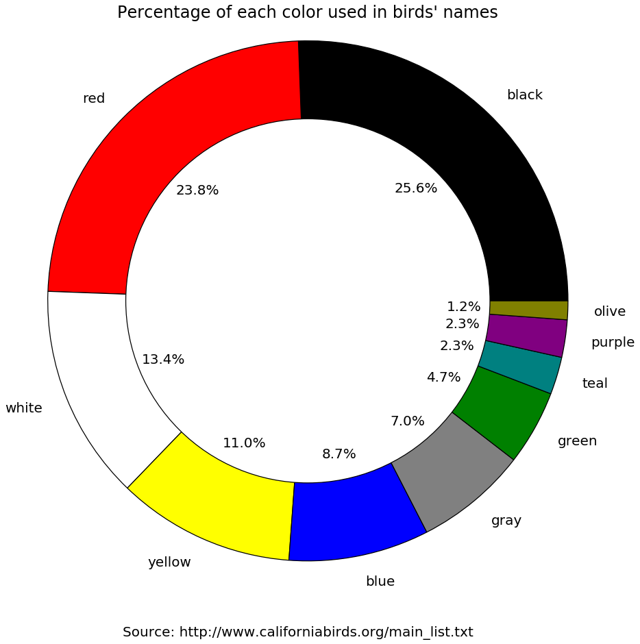

<h1>
BirdScraper 
</h1>
<h3> 
    This program scrapes a list of birds and cleans the list.
    It then groups the birds by the colors used in their names (i.e. black storm-petrel)
    and plots the distribution with matplotlib.
</h3>

```python
import operator
import requests
from collections import defaultdict
import matplotlib.pyplot as plt
```


```python
# Getting the list of birds:
page = requests.get('http://www.californiabirds.org/main_list.txt')
birds_text = page.text
birds_list = birds_text.split('\n')
```

    ['Anseriformes - Screamers, Swans, Geese, and Ducks\r', '\tAnatidae - Ducks, Geese, and Swans\r', '\t\tBlack-bellied Whistling-Duck (Dendrocygna autumnalis) - *P\r', '\t\tFulvous Whistling-Duck (Dendrocygna bicolor) - *\r', '\t\tEmperor Goose (Anser canagicus) - *\r', '\t\tSnow Goose (Anser caerulescens)\r', "\t\tRoss's Goose (Anser rossii)\r", '\t\tGreater White-fronted Goose (Anser albifrons)\r', '\t\tTundra Bean-Goose (Anser serrirostris) - *P\r', '\t\tBrant (Branta bernicla)\r', '\t\tCackling Goose (Branta hutchinsii)\r', '\t\tCanada Goose (Branta canadensis)\r', '\t\tTrumpeter Swan (Cygnus buccinator) - P\r', '\t\tTundra Swan (Cygnus columbianus)\r', '\t\tWhooper Swan (Cygnus cygnus) - *P\r', '\t\tWood Duck (Aix sponsa)\r', '\t\tBaikal Teal (Sibirionetta formosa) - *\r', '\t\tGarganey (Spatula querquedula) - *\r', '\t\tBlue-winged Teal (Spatula discors)\r', '\t\tCinnamon Teal (Spatula cyanoptera)\r', '\t\tNorthern Shoveler (Spatula clypeata)\r', '\t\tGadwall (Mareca strepera)\r', '\t\tFalcated Duck (Mareca falcata) - *P\t\r', '\t\tEurasian Wigeon (Mareca penelope)\r', '\t\tAmerican Wigeon (Mareca americana)\r', '\t\tMallard (Anas platyrhynchos)\r', '\t\tAmerican Black Duck (Anas rubripes) - *\r', '\t\tNorthern Pintail (Anas acuta)\r', '\t\tGreen-winged Teal (Anas crecca)\r', '\t\tCanvasback (Aythya valisineria)\r', '\t\tRedhead (Aythya americana)\r', '\t\tCommon Pochard (Aythya ferina) - *P\r', '\t\tRing-necked Duck (Aythya collaris)\r', '\t\tTufted Duck (Aythya fuligula)\r', '\t\tGreater Scaup (Aythya marila)\r', '\t\tLesser Scaup (Aythya affinis)\r', "\t\tSteller's Eider (Polysticta stelleri) - *P\r", '\t\tKing Eider (Somateria spectabilis) - *\r', '\t\tCommon Eider (Somateria mollissima) - *P\r', '\t\tHarlequin Duck (Histrionicus histrionicus)\r', '\t\tSurf Scoter (Melanitta perspicillata)\r', '\t\tWhite-winged Scoter (Melanitta fusca)\r', '\t\tCommon Scoter (Melanitta nigra) - *P\r', '\t\tBlack Scoter (Melanitta americana)\r', '\t\tLong-tailed Duck (Clangula hyemalis)\r', '\t\tBufflehead (Bucephala albeola)\r', '\t\tCommon Goldeneye (Bucephala clangula)\r', "\t\tBarrow's Goldeneye (Bucephala islandica)\r", '\t\tSmew (Mergellus albellus) - *PV\r', '\t\tHooded Merganser (Lophodytes cucullatus)\r', '\t\tCommon Merganser (Mergus merganser)\r', '\t\tRed-breasted Merganser (Mergus serrator)\r', '\t\tRuddy Duck (Oxyura jamaicensis)\r', 'Galliformes - Gallinaceous Birds\r', '\tOdontophoridae - New World Quail\r', '\t\tMountain Quail (Oreortyx pictus)\r', '\t\tCalifornia Quail (Callipepla californica)\r', "\t\tGambel's Quail (Callipepla gambelii)\r", '\tPhasianidae - Partridges, Grouse, Turkeys, and Old World Quail\r', '\t\tChukar (Alectoris chukar) - I\r', '\t\tRing-necked Pheasant (Phasianus colchicus) - I\r', '\t\tRuffed Grouse (Bonasa umbellus)\r', '\t\tGreater Sage-Grouse (Centrocercus urophasianus)\r', '\t\tWhite-tailed Ptarmigan (Lagopus leucura) - IP\r', '\t\tSooty Grouse (Dendragapus fuliginosus)\r', '\t\tSharp-tailed Grouse (Tympanuchus phasianellus) - E\r', '\t\tWild Turkey (Meleagris gallopavo) - I\r', 'Podicipediformes - Grebes\r', '\tPodicipedidae - Grebes\r', '\t\tLeast Grebe (Tachybaptus dominicus) - *\r', '\t\tPied-billed Grebe (Podilymbus podiceps)\r', '\t\tHorned Grebe (Podiceps auritus)\r', '\t\tRed-necked Grebe (Podiceps grisegena)\r', '\t\tEared Grebe (Podiceps nigricollis)\r', '\t\tWestern Grebe (Aechmophorus occidentalis)\r', "\t\tClark's Grebe (Aechmophorus clarkii)\r", 'Columbiformes - Pigeons and Doves\r', '\tColumbidae - Pigeons and Doves\r', '\t\tRock Pigeon (Columba livia) - I\r', '\t\tBand-tailed Pigeon (Patagioenas fasciata)\r', '\t\tOriental Turtle-Dove (Streptopelia orientalis) - *PV\r', '\t\tEurasian Collared-Dove (Streptopelia decaocto) - I\r', '\t\tSpotted Dove (Streptopelia chinensis) - I\r', '\t\tInca Dove (Columbina inca)\r', '\t\tCommon Ground-Dove (Columbina passerina)\r', '\t\tRuddy Ground-Dove (Columbina talpacoti) - *\r', '\t\tWhite-winged Dove (Zenaida asiatica)\r', '\t\tMourning Dove (Zenaida macroura)\r', 'Cuculiformes - Cuckoos and Allies\r', '\tCuculidae - Cuckoos, Roadrunners, and Anis\r', '\t\tCommon Cuckoo (Cuculus canorus) - *PV\r', '\t\tYellow-billed Cuckoo (Coccyzus americanus)\r', '\t\tBlack-billed Cuckoo (Coccyzus erythropthalmus) - *\r', '\t\tGreater Roadrunner (Geococcyx californianus)\r', '\t\tGroove-billed Ani (Crotophaga sulcirostris) - *P\r', 'Caprimulgiformes - Nightjars\r', '\tCaprimulgidae - Nightjars\r', '\t\tLesser Nighthawk (Chordeiles acutipennis)\r', '\t\tCommon Nighthawk (Chordeiles minor)\r', '\t\tCommon Poorwill (Phalaenoptilus nuttallii)\r', "\t\tChuck-will's-widow (Antrostomus carolinensis) - *\r", '\t\tBuff-collared Nightjar (Antrostomus ridgwayi) - *\r', '\t\tEastern Whip-poor-will (Antrostomus vociferus) - *PA\r', '\t\tMexican Whip-poor-will (Antrostomus arizonae)\r', 'Apodiformes - Swifts and Hummingbirds\r', '\tApodidae - Swifts\r', '\t\tBlack Swift (Cypseloides niger)\r', '\t\tWhite-collared Swift (Streptoprocne zonaris) - *S\r', '\t\tChimney Swift (Chaetura pelagica)\r', "\t\tVaux's Swift (Chaetura vauxi)\r", '\t\tCommon Swift (Apus apus) - *P \r', '\t\tWhite-throated Swift (Aeronautes saxatalis)\r', '\tTrochilidae - Hummingbirds\r', '\t\tMexican Violetear (Colibri thalassinus) - *P\r', "\t\tRivoli's Hummingbird (Eugenes fulgens) - *P\r", '\t\tBlue-throated Hummingbird (Lampornis clemenciae) - *P\r', '\t\tRuby-throated Hummingbird (Archilochus colubris) - *\r', '\t\tBlack-chinned Hummingbird (Archilochus alexandri)\r', "\t\tAnna's Hummingbird (Calypte anna)\r", "\t\tCosta's Hummingbird (Calypte costae)\r", '\t\tBroad-tailed Hummingbird (Selasphorus platycercus)\r', '\t\tRufous Hummingbird (Selasphorus rufus)\r', "\t\tAllen's Hummingbird (Selasphorus sasin)\r", '\t\tCalliope Hummingbird (Selasphorus calliope)\r', '\t\tBroad-billed Hummingbird (Cynanthus latirostris) - *P\r', '\t\tViolet-crowned Hummingbird (Amazilia violiceps) - *P\r', "\t\tXantus's Hummingbird (Hylocharis xantusii) - *P\r", 'Gruiformes - Rails, Cranes, and Allies\r', '\tRallidae - Rails, Gallinules, and Coots\r', '\t\tYellow Rail (Coturnicops noveboracensis)\r', '\t\tBlack Rail (Laterallus jamaicensis)\r', "\t\tRidgway's Rail (Rallus obsoletus)\r", '\t\tVirginia Rail (Rallus limicola)\r', '\t\tSora (Porzana carolina)\r', '\t\tPurple Gallinule (Porphyrio martinicus) - *\r', '\t\tCommon Gallinule (Gallinula galeata)\r', '\t\tAmerican Coot (Fulica americana)\r', '\tGruidae - Cranes\r', '\t\tSandhill Crane (Antigone canadensis)\r', '\t\tCommon Crane (Grus grus) - *P\r', 'Charadriiformes - Shorebirds, Gulls, Auks, and Allies\r', '\tRecurvirostridae - Stilts and Avocets\r', '\t\tBlack-necked Stilt (Himantopus mexicanus)\r', '\t\tAmerican Avocet (Recurvirostra americana)\r', '\tHaematopodidae - Oystercatchers\r', '\t\tAmerican Oystercatcher (Haematopus palliatus)\r', '\t\tBlack Oystercatcher (Haematopus bachmani)\r', '\tCharadriidae - Lapwings and Plovers\r', '\t\tBlack-bellied Plover (Pluvialis squatarola)\r', '\t\tAmerican Golden-Plover (Pluvialis dominica) \r', '\t\tPacific Golden-Plover (Pluvialis fulva)\r', '\t\tLesser Sand-Plover (Charadrius mongolus) - *P\r', '\t\tGreater Sand-Plover (Charadrius leschenaultii) - *PV\r', '\t\tSnowy Plover (Charadrius nivosus)\r', "\t\tWilson's Plover (Charadrius wilsonia) - *\r", '\t\tCommon Ringed Plover (Charadrius hiaticula) - *PVA\r', '\t\tSemipalmated Plover (Charadrius semipalmatus)\r', '\t\tPiping Plover (Charadrius melodus) - *P\r', '\t\tKilldeer (Charadrius vociferus)\r', '\t\tMountain Plover (Charadrius montanus)\r', '\t\tEurasian Dotterel (Charadrius morinellus) - *PV\r', '\tScolopacidae - Sandpipers, Phalaropes, and Allies\r', '\t\tUpland Sandpiper (Bartramia longicauda) - *\r', '\t\tBristle-thighed Curlew (Numenius tahitiensis) - *PV\r', '\t\tWhimbrel (Numenius phaeopus)\r', '\t\tLittle Curlew (Numenius minutus) - *P\r', '\t\tLong-billed Curlew (Numenius americanus)\r', '\t\tBar-tailed Godwit (Limosa lapponica) - *\r', '\t\tHudsonian Godwit (Limosa haemastica) - *P\r', '\t\tMarbled Godwit (Limosa fedoa)\r', '\t\tRuddy Turnstone (Arenaria interpres)\r', '\t\tBlack Turnstone (Arenaria melanocephala)\r', '\t\tRed Knot (Calidris canutus)\r', '\t\tSurfbird (Calidris virgata)\r', '\t\tRuff (Calidris pugnax)\r', '\t\tSharp-tailed Sandpiper (Calidris acuminata)\r', '\t\tStilt Sandpiper (Calidris himantopus)\r', '\t\tCurlew Sandpiper (Calidris ferruginea) - *\r', '\t\tLong-toed Stint (Calidris subminuta) - *P\r', '\t\tRed-necked Stint (Calidris ruficollis) - *P\r', '\t\tSanderling (Calidris alba)\r', '\t\tDunlin (Calidris alpina)\r', '\t\tRock Sandpiper (Calidris ptilocnemis)\r', '\t\tPurple Sandpiper (Calidris maritima) - *PV\r', "\t\tBaird's Sandpiper (Calidris bairdii)\r", '\t\tLittle Stint (Calidris minuta) - *\r', '\t\tLeast Sandpiper (Calidris minutilla)\r', '\t\tWhite-rumped Sandpiper (Calidris fuscicollis) - *\r', '\t\tBuff-breasted Sandpiper (Calidris subruficollis)\r', '\t\tPectoral Sandpiper (Calidris melanotos)\r', '\t\tSemipalmated Sandpiper (Calidris pusilla)\r', '\t\tWestern Sandpiper (Calidris mauri)\r', '\t\tShort-billed Dowitcher (Limnodromus griseus)\r', '\t\tLong-billed Dowitcher (Limnodromus scolopaceus)\r', '\t\tJack Snipe (Lymnocryptes minimus) - *\r', '\t\tAmerican Woodcock (Scolopax minor) - *P\r', '\t\tCommon Snipe (Gallinago gallinago) - *P\r', "\t\tWilson's Snipe (Gallinago delicata)\r", '\t\tTerek Sandpiper (Xenus cinereus) - *PV\r', '\t\tSpotted Sandpiper (Actitis macularius)\r', '\t\tSolitary Sandpiper (Tringa solitaria)\r', '\t\tGray-tailed Tattler (Tringa brevipes) - *P\r', '\t\tWandering Tattler (Tringa incana)\r', '\t\tLesser Yellowlegs (Tringa flavipes)\r', '\t\tWillet (Tringa semipalmata)\t\t\r', '\t\tSpotted Redshank (Tringa erythropus) - *P\r', '\t\tCommon Greenshank (Tringa nebularia) - *PV\r', '\t\tGreater Yellowlegs (Tringa melanoleuca)\r', '\t\tWood Sandpiper (Tringa glareola) - *P\r', '\t\tMarsh Sandpiper (Tringa stagnatilis) - *P\r', "\t\tWilson's Phalarope (Phalaropus tricolor)\r", '\t\tRed-necked Phalarope (Phalaropus lobatus)\r', '\t\tRed Phalarope (Phalaropus fulicarius)\r', '\tStercorariidae - Skuas\r', '\t\tSouth Polar Skua (Stercorarius maccormicki)\r', '\t\tPomarine Jaeger (Stercorarius pomarinus)\r', '\t\tParasitic Jaeger (Stercorarius parasiticus)\r', '\t\tLong-tailed Jaeger (Stercorarius longicaudus)\r', '\tAlcidae - Auks, Murres, and Puffins\r', '\t\tCommon Murre (Uria aalge)\r', '\t\tThick-billed Murre (Uria lomvia) - *\r', '\t\tPigeon Guillemot (Cepphus columba)\r', '\t\tLong-billed Murrelet (Brachyramphus perdix) - *\r', '\t\tMarbled Murrelet (Brachyramphus marmoratus)\r', "\t\tKittlitz's Murrelet (Brachyramphus brevirostris) - *\r", "\t\tScripps's Murrelet (Synthliboramphus scrippsi)\r", '\t\tGuadalupe Murrelet (Synthliboramphus hypoleucus)\r', "\t\tCraveri's Murrelet (Synthliboramphus craveri)\r", '\t\tAncient Murrelet (Synthliboramphus antiquus)\r', "\t\tCassin's Auklet (Ptychoramphus aleuticus)\r", '\t\tParakeet Auklet (Aethia psittacula) \r', '\t\tLeast Auklet (Aethia pusilla) - *\r', '\t\tCrested Auklet (Aethia cristatella) - *\r', '\t\tRhinoceros Auklet (Cerorhinca monocerata)\r', '\t\tHorned Puffin (Fratercula corniculata)\r', '\t\tTufted Puffin (Fratercula cirrhata)\r', '\tLaridae - Gulls, Terns, and Skimmers\r', '\t\tSwallow-tailed Gull (Creagrus furcatus) - *P\r', '\t\tBlack-legged Kittiwake (Rissa tridactyla)\r', '\t\tRed-legged Kittiwake (Rissa brevirostris) - *\r', '\t\tIvory Gull (Pagophila eburnea) - *P\r', "\t\tSabine's Gull (Xema sabini)\r", "\t\tBonaparte's Gull (Chroicocephalus philadelphia)\r", '\t\tBlack-headed Gull (Chroicocephalus ridibundus) - *P\r', '\t\tLittle Gull (Hydrocoloeus minutus) \r', "\t\tRoss's Gull (Rhodostethia rosea) - *P\r", '\t\tLaughing Gull (Leucophaeus atricilla)\r', "\t\tFranklin's Gull (Leucophaeus pipixcan)\r", "\t\tBelcher's Gull (Larus belcheri) - *PV\r", '\t\tBlack-tailed Gull (Larus crassirostris) - *\r', "\t\tHeermann's Gull (Larus heermanni)\r", '\t\tMew Gull (Larus canus)\r', '\t\tRing-billed Gull (Larus delawarensis)\r', '\t\tWestern Gull (Larus occidentalis)\r', '\t\tYellow-footed Gull (Larus livens)\r', '\t\tCalifornia Gull (Larus californicus)\r', '\t\tHerring Gull (Larus argentatus)\r', '\t\tIceland Gull (Larus glaucoides)\r', '\t\tLesser Black-backed Gull (Larus fuscus) \r', '\t\tSlaty-backed Gull (Larus schistisagus) - *P\r', '\t\tGlaucous-winged Gull (Larus glaucescens)\r', '\t\tGlaucous Gull (Larus hyperboreus)\r', '\t\tGreat Black-backed Gull (Larus marinus) - *P\r', '\t\tKelp Gull (Larus dominicanus) - *P\r', '\t\tSooty Tern (Onychoprion fuscatus) - *\r', '\t\tBridled Tern (Onychoprion anaethetus) - *P\r', '\t\tLeast Tern (Sternula antillarum)\r', '\t\tGull-billed Tern (Gelochelidon nilotica)\r', '\t\tCaspian Tern (Hydroprogne caspia)\r', '\t\tBlack Tern (Chlidonias niger)\r', '\t\tWhite-winged Tern (Chlidonias leucopterus) - *PV\r', '\t\tCommon Tern (Sterna hirundo)\r', '\t\tArctic Tern (Sterna paradisaea)\r', "\t\tForster's Tern (Sterna forsteri)\r", '\t\tRoyal Tern (Thalasseus maximus)\r', '\t\tSandwich Tern (Thalasseus sandvicensis) - *P\r', '\t\tElegant Tern (Thalasseus elegans)\r', '\t\tBlack Skimmer (Rynchops niger)\r', 'Phaethontiformes - Tropicbirds\r', '\tPhaethontidae - Tropicbirds\r', '\t\tWhite-tailed Tropicbird (Phaethon lepturus) - *P\r', '\t\tRed-billed Tropicbird (Phaethon aethereus)\r', '\t\tRed-tailed Tropicbird (Phaethon rubricauda) - *\r', 'Gaviiformes - Loons\r', '\tGaviidae - Loons\r', '\t\tRed-throated Loon (Gavia stellata)\r', '\t\tArctic Loon (Gavia arctica) - *\r', '\t\tPacific Loon (Gavia pacifica)\r', '\t\tCommon Loon (Gavia immer)\r', '\t\tYellow-billed Loon (Gavia adamsii) - *\r', 'Procellariiformes - Tube-nosed Swimmers\r', '\tDiomedeidae - Albatrosses\r', '\t\tWhite-capped Albatross (Thalassarche cauta) - *P\r', "\t\tSalvin's Albatross (Thalassarche salvini) - *P\r", '\t\tChatham Albatross (Thalassarche eremita) - *P\r', '\t\tLight-mantled Albatross (Phoebetria palpebrata) - *PV\r', '\t\tWandering Albatross (Diomedea exulans) - *P\r', '\t\tLaysan Albatross (Phoebastria immutabilis)\r', '\t\tBlack-footed Albatross (Phoebastria nigripes)\r', '\t\tShort-tailed Albatross (Phoebastria albatrus) - *\r', '\tProcellariidae - Shearwaters and Petrels\r', '\t\tNorthern Fulmar (Fulmarus glacialis)\r', '\t\tGreat-winged Petrel (Pterodroma macroptera) - *PV\r', '\t\tKermadec Petrel (Pterodroma neglecta) - *P \r', "\t\tMurphy's Petrel (Pterodroma ultima)\r", '\t\tMottled Petrel (Pterodroma inexpectata)\r', '\t\tHawaiian Petrel (Pterodroma sandwichensis) - PV\r', "\t\tCook's Petrel (Pterodroma cookii)\r", "\t\tStejneger's Petrel (Pterodroma longirostris) - *P\r", "\t\tBulwer's Petrel (Bulweria bulwerii) - *P\r", "\t\tJouanin's Petrel (Bulweria fallax) - *P\r", '\t\tWhite-chinned Petrel (Procellaria aequinoctialis) - *PV\r', "\t\tParkinson's Petrel (Procellaria parkinsoni) - *P\r", '\t\tStreaked Shearwater (Calonectris leucomelas) - *\r', "\t\tCory's Shearwater (Calonectris diomedea) - *P\r", '\t\tWedge-tailed Shearwater (Ardenna pacifica) - *P\r', "\t\tBuller's Shearwater (Ardenna bulleri)\r", '\t\tShort-tailed Shearwater (Ardenna tenuirostris)\r', '\t\tSooty Shearwater (Ardenna grisea)\r', '\t\tGreat Shearwater (Ardenna gravis) - *P\r', '\t\tPink-footed Shearwater (Ardenna creatopus)\r', '\t\tFlesh-footed Shearwater (Ardenna carneipes)\r', '\t\tManx Shearwater (Puffinus puffinus) - PV\r', "\t\tNewell's Shearwater (Puffinus newelli) - *\r", '\t\tBlack-vented Shearwater (Puffinus opisthomelas)\r', '\tHydrobatidae - Storm-Petrels\r', "\t\tWilson's Storm-Petrel (Oceanites oceanicus)\r", '\t\tFork-tailed Storm-Petrel (Oceanodroma furcata)\r', '\t\tRinged Storm-Petrel (Oceanodroma hornbyi) - *P\r', "\t\tLeach's Storm-Petrel (Oceanodroma leucorhoa)\r", "\t\tTownsend's Storm-Petrel (Oceanodroma socorroensis) \r", '\t\tAshy Storm-Petrel (Oceanodroma homochroa)\r', '\t\tWedge-rumped Storm-Petrel (Oceanodroma tethys) - *\r', '\t\tBlack Storm-Petrel (Oceanodroma melania)\r', "\t\tTristram's Storm-Petrel (Oceanodroma tristrami) - *P\r", '\t\tLeast Storm-Petrel (Oceanodroma microsoma)\r', 'Ciconiiformes - Storks\r', '\tCiconiidae - Storks\r', '\t\tWood Stork (Mycteria americana)\r', 'Suliformes - Frigatebirds, Boobies, Cormorants, Darters, and Allies\r', '\tFregatidae - Frigatebirds\r', '\t\tMagnificent Frigatebird (Fregata magnificens) \r', '\t\tGreat Frigatebird (Fregata minor) - *P\r', '\t\tLesser Frigatebird (Fregata ariel) - *P\t\r', '\tSulidae - Boobies and Gannets\r', '\t\tMasked Booby (Sula dactylatra) - *P\r', '\t\tNazca Booby (Sula granti) - *P\r', '\t\tBlue-footed Booby (Sula nebouxii)\r', '\t\tBrown Booby (Sula leucogaster)\r', '\t\tRed-footed Booby (Sula sula) - *\r', '\t\tNorthern Gannet (Morus bassanus) - *P\r', '\tPhalacrocoracidae - Cormorants\r', "\t\tBrandt's Cormorant (Phalacrocorax penicillatus)\r", '\t\tNeotropic Cormorant (Phalacrocorax brasilianus) - P\r', '\t\tDouble-crested Cormorant (Phalacrocorax auritus)\r', '\t\tPelagic Cormorant (Phalacrocorax pelagicus)\r', '\tAnhingidae - Darters\r', '\t\tAnhinga (Anhinga anhinga) - *P\r', 'Pelecaniformes - Pelicans, Herons, Ibises, and Allies\r', '\tPelecanidae - Pelicans\r', '\t\tAmerican White Pelican (Pelecanus erythrorhynchos)\r', '\t\tBrown Pelican (Pelecanus occidentalis)\r', '\tArdeidae - Herons, Bitterns, and Allies\r', '\t\tAmerican Bittern (Botaurus lentiginosus)\r', '\t\tLeast Bittern (Ixobrychus exilis)\r', '\t\tGreat Blue Heron (Ardea herodias)\r', '\t\tGreat Egret (Ardea alba)\r', '\t\tSnowy Egret (Egretta thula)\r', '\t\tLittle Blue Heron (Egretta caerulea)\r', '\t\tTricolored Heron (Egretta tricolor) - *\r', '\t\tReddish Egret (Egretta rufescens)\r', '\t\tCattle Egret (Bubulcus ibis)\r', '\t\tGreen Heron (Butorides virescens)\r', '\t\tBlack-crowned Night-Heron (Nycticorax nycticorax)\r', '\t\tYellow-crowned Night-Heron (Nyctanassa violacea) \r', '\tThreskiornithidae - Ibises and Spoonbills\r', '\t\tWhite Ibis (Eudocimus albus) - *\r', '\t\tGlossy Ibis (Plegadis falcinellus) - *P\r', '\t\tWhite-faced Ibis (Plegadis chihi)\r', '\t\tRoseate Spoonbill (Platalea ajaja) - *\r', 'Cathartiformes - New World Vultures\r', '\tCathartidae - New World Vultures\r', '\t\tBlack Vulture (Coragyps atratus) - *P\r', '\t\tTurkey Vulture (Cathartes aura)\r', '\t\tCalifornia Condor (Gymnogyps californianus) - RI\r', 'Accipitriformes - Hawks, Kites, Eagles, and Allies\r', '\tPandionidae - Ospreys\r', '\t\tOsprey (Pandion haliaetus)\r', '\tAccipitridae - Hawks, Kites, Eagles, and Allies\t\r', '\t\tSwallow-tailed Kite (Elanoides forficatus) - *P\r', '\t\tWhite-tailed Kite (Elanus leucurus)\r', '\t\tMississippi Kite (Ictinia mississippiensis) - *\r', '\t\tBald Eagle (Haliaeetus leucocephalus)\r', '\t\tNorthern Harrier (Circus hudsonius)\r', '\t\tSharp-shinned Hawk (Accipiter striatus)\r', "\t\tCooper's Hawk (Accipiter cooperii)\r", '\t\tNorthern Goshawk (Accipiter gentilis)\r', '\t\tCommon Black Hawk (Buteogallus anthracinus) - *P\r', "\t\tHarris's Hawk (Parabuteo unicinctus) \r", '\t\tGray Hawk (Buteo plagiatus) - *PV\r', '\t\tRed-shouldered Hawk (Buteo lineatus)\r', '\t\tBroad-winged Hawk (Buteo platypterus)\r', "\t\tSwainson's Hawk (Buteo swainsoni)\r", '\t\tZone-tailed Hawk (Buteo albonotatus)\r', '\t\tRed-tailed Hawk (Buteo jamaicensis)\r', '\t\tRough-legged Hawk (Buteo lagopus)\r', '\t\tFerruginous Hawk (Buteo regalis)\r', '\t\tGolden Eagle (Aquila chrysaetos)\r', 'Strigiformes - Owls\r', '\tTytonidae - Barn Owls\r', '\t\tBarn Owl (Tyto alba)\r', '\tStrigidae - Typical Owls\r', '\t\tFlammulated Owl (Psiloscops flammeolus)\r', '\t\tWestern Screech-Owl (Megascops kennicottii)\r', '\t\tGreat Horned Owl (Bubo virginianus)\r', '\t\tSnowy Owl (Bubo scandiacus) - *\r', '\t\tNorthern Pygmy-Owl (Glaucidium gnoma)\r', '\t\tElf Owl (Micrathene whitneyi) - *\r', '\t\tBurrowing Owl (Athene cunicularia)\r', '\t\tSpotted Owl (Strix occidentalis)\r', '\t\tBarred Owl (Strix varia)\r', '\t\tGreat Gray Owl (Strix nebulosa)\r', '\t\tLong-eared Owl (Asio otus)\r', '\t\tShort-eared Owl (Asio flammeus)\r', '\t\tNorthern Saw-whet Owl (Aegolius acadicus)\r', 'Coraciiformes - Rollers, Motmots, Kingfishers, and Allies\r', '\tAlcedinidae - Kingfishers\r', '\t\tBelted Kingfisher (Megaceryle alcyon)\r', 'Piciformes - Puffbirds, Jacamars, Toucans, Woodpeckers, and Allies\r', '\tPicidae - Woodpeckers and Allies\r', '\t\tEurasian Wryneck (Jynx torquilla) - *\r', "\t\tLewis's Woodpecker (Melanerpes lewis)\r", '\t\tRed-headed Woodpecker (Melanerpes erythrocephalus) - *\r', '\t\tAcorn Woodpecker (Melanerpes formicivorus)\r', '\t\tGila Woodpecker (Melanerpes uropygialis)\r', "\t\tWilliamson's Sapsucker (Sphyrapicus thyroideus)\r", '\t\tYellow-bellied Sapsucker (Sphyrapicus varius)\r', '\t\tRed-naped Sapsucker (Sphyrapicus nuchalis)\r', '\t\tRed-breasted Sapsucker (Sphyrapicus ruber)\r', '\t\tLadder-backed Woodpecker (Picoides scalaris)\r', "\t\tNuttall's Woodpecker (Picoides nuttallii)\r", '\t\tDowny Woodpecker (Picoides pubescens)\r', '\t\tHairy Woodpecker (Picoides villosus)\r', '\t\tWhite-headed Woodpecker (Picoides albolarvatus)\r', '\t\tBlack-backed Woodpecker (Picoides arcticus)\r', '\t\tNorthern Flicker (Colaptes auratus)\r', '\t\tGilded Flicker (Colaptes chrysoides)\r', '\t\tPileated Woodpecker (Dryocopus pileatus)\r', 'Falconiformes - Caracaras and Falcons\r', '\tFalconidae - Caracaras and Falcons\r', '\t\tCrested Caracara (Caracara cheriway) - *PV\r', '\t\tEurasian Kestrel (Falco tinnunculus) - *P\r', '\t\tAmerican Kestrel (Falco sparverius)\r', '\t\tMerlin (Falco columbarius)\r', '\t\tGyrfalcon (Falco rusticolus) - *\r', '\t\tPeregrine Falcon (Falco peregrinus)\r', '\t\tPrairie Falcon (Falco mexicanus)\r', 'Psittaciformes - Parrots\r', '\tPsittacidae - African and New World Parrots\r', '\t\tRed-crowned Parrot (Amazona viridigenalis) - I\r', 'Passeriformes - Passerine Birds\r', '\tTyrannidae - Tyrant Flycatchers\r', '\t\tOlive-sided Flycatcher (Contopus cooperi)\r', '\t\tGreater Pewee (Contopus pertinax) - *\r', '\t\tWestern Wood-Pewee (Contopus sordidulus)\r', '\t\tEastern Wood-Pewee (Contopus virens) - *PA\r', '\t\tYellow-bellied Flycatcher (Empidonax flaviventris) - *\r', '\t\tAlder Flycatcher (Empidonax alnorum) - *\r', '\t\tWillow Flycatcher (Empidonax traillii)\r', '\t\tLeast Flycatcher (Empidonax minimus)\r', "\t\tHammond's Flycatcher (Empidonax hammondii)\r", '\t\tGray Flycatcher (Empidonax wrightii)\r', '\t\tDusky Flycatcher (Empidonax oberholseri)\r', '\t\tPacific-slope Flycatcher (Empidonax difficilis)\r', '\t\tCordilleran Flycatcher (Empidonax occidentalis)\r', '\t\tBuff-breasted Flycatcher (Empidonax fulvifrons) - *P\r', '\t\tBlack Phoebe (Sayornis nigricans)\r', '\t\tEastern Phoebe (Sayornis phoebe)\r', "\t\tSay's Phoebe (Sayornis saya)\r", '\t\tVermilion Flycatcher (Pyrocephalus rubinus)\r', '\t\tDusky-capped Flycatcher (Myiarchus tuberculifer)\r', '\t\tAsh-throated Flycatcher (Myiarchus cinerascens)\r', "\t\tNutting's Flycatcher (Myiarchus nuttingi) - *PVA\r", '\t\tGreat Crested Flycatcher (Myiarchus crinitus) - *\r', '\t\tBrown-crested Flycatcher (Myiarchus tyrannulus)\r', '\t\tSulphur-bellied Flycatcher (Myiodynastes luteiventris) - *PV\r', '\t\tTropical Kingbird (Tyrannus melancholicus)\r', "\t\tCouch's Kingbird (Tyrannus couchii) - *PA\r", "\t\tCassin's Kingbird (Tyrannus vociferans)\r", '\t\tThick-billed Kingbird (Tyrannus crassirostris) - *PVA\r', '\t\tWestern Kingbird (Tyrannus verticalis)\r', '\t\tEastern Kingbird (Tyrannus tyrannus)\r', '\t\tScissor-tailed Flycatcher (Tyrannus forficatus)\r', '\t\tFork-tailed Flycatcher (Tyrannus savana) - *P\r', '\tLaniidae - Shrikes\r', '\t\tBrown Shrike (Lanius cristatus) - *P\r', '\t\tLoggerhead Shrike (Lanius ludovicianus)\r', '\t\tNorthern Shrike (Lanius borealis)\r', '\tVireonidae - Vireos\r', '\t\tWhite-eyed Vireo (Vireo griseus) - *PA\r', "\t\tBell's Vireo (Vireo bellii)\r", '\t\tGray Vireo (Vireo vicinior)\r', "\t\tHutton's Vireo (Vireo huttoni)\r", '\t\tYellow-throated Vireo (Vireo flavifrons)\r', "\t\tCassin's Vireo (Vireo cassinii)\r", '\t\tBlue-headed Vireo (Vireo solitarius) - *\r', '\t\tPlumbeous Vireo (Vireo plumbeus)\r', '\t\tPhiladelphia Vireo (Vireo philadelphicus)\r', '\t\tWarbling Vireo (Vireo gilvus)\r', '\t\tRed-eyed Vireo (Vireo olivaceus)\r', '\t\tYellow-green Vireo (Vireo flavoviridis)\r', '\tCorvidae - Crows and Jays\r', '\t\tGray Jay (Perisoreus canadensis)\r', '\t\tPinyon Jay (Gymnorhinus cyanocephalus)\r', "\t\tSteller's Jay (Cyanocitta stelleri)\r", '\t\tBlue Jay (Cyanocitta cristata) - *\r', '\t\tIsland Scrub-Jay (Aphelocoma insularis)\r', '\t\tCalifornia Scrub-Jay (Aphelocoma californica)\r', "\t\tWoodhouse's Scrub-Jay (Aphelocoma woodhouseii)\r", "\t\tClark's Nutcracker (Nucifraga columbiana)\r", '\t\tBlack-billed Magpie (Pica hudsonia)\r', '\t\tYellow-billed Magpie (Pica nuttalli)\r', '\t\tAmerican Crow (Corvus brachyrhynchos)\r', '\t\tCommon Raven (Corvus corax)\r', '\tAlaudidae - Larks\r', '\t\tEurasian Skylark (Alauda arvensis) - *P\r', '\t\tHorned Lark (Eremophila alpestris)\r', '\tHirundinidae - Swallows\r', '\t\tPurple Martin (Progne subis)\r', '\t\tTree Swallow (Tachycineta bicolor)\r', '\t\tViolet-green Swallow (Tachycineta thalassina)\r', '\t\tNorthern Rough-winged Swallow (Stelgidopteryx serripennis)\r', '\t\tBank Swallow (Riparia riparia)\r', '\t\tCliff Swallow (Petrochelidon pyrrhonota)\r', '\t\tCave Swallow (Petrochelidon fulva) - *P\r', '\t\tBarn Swallow (Hirundo rustica)\r', '\tParidae - Chickadees and Titmice\r', '\t\tBlack-capped Chickadee (Poecile atricapillus)\r', '\t\tMountain Chickadee (Poecile gambeli)\r', '\t\tChestnut-backed Chickadee (Poecile rufescens)\r', '\t\tOak Titmouse (Baeolophus inornatus)\r', '\t\tJuniper Titmouse (Baeolophus ridgwayi)\r', '\tRemizidae - Penduline Tits and Verdins\r', '\t\tVerdin (Auriparus flaviceps)\r', '\tAegithalidae - Long-tailed Tits and Bushtits\r', '\t\tBushtit (Psaltriparus minimus)\r', '\tSittidae - Nuthatches\r', '\t\tRed-breasted Nuthatch (Sitta canadensis)\r', '\t\tWhite-breasted Nuthatch (Sitta carolinensis)\r', '\t\tPygmy Nuthatch (Sitta pygmaea)\r', '\tCerthiidae - Creepers\r', '\t\tBrown Creeper (Certhia americana)\r', '\tTroglodytidae - Wrens\r', '\t\tRock Wren (Salpinctes obsoletus)\r', '\t\tCanyon Wren (Catherpes mexicanus)\r', '\t\tHouse Wren (Troglodytes aedon)\r', '\t\tPacific Wren (Troglodytes pacificus)\r', '\t\tWinter Wren (Troglodytes hiemalis) - *PA\r', '\t\tSedge Wren (Cistothorus platensis) - *PA\r', '\t\tMarsh Wren (Cistothorus palustris)\r', "\t\tBewick's Wren (Thryomanes bewickii)\r", '\t\tCactus Wren (Campylorhynchus brunneicapillus)\r', '\tPolioptilidae - Gnatcatchers and Gnatwrens\t\r', '\t\tBlue-gray Gnatcatcher (Polioptila caerulea)\r', '\t\tCalifornia Gnatcatcher (Polioptila californica)\r', '\t\tBlack-tailed Gnatcatcher (Polioptila melanura)\r', '\tCinclidae - Dippers\r', '\t\tAmerican Dipper (Cinclus mexicanus)\r', '\tRegulidae - Kinglets\r', '\t\tGolden-crowned Kinglet (Regulus satrapa)\r', '\t\tRuby-crowned Kinglet (Regulus calendula)\r', '\tPhylloscopidae - Leaf Warblers\t\r', '\t\tDusky Warbler (Phylloscopus fuscatus) - *\r', '\t\tArctic/Kamchatka Leaf Warbler (Phylloscopus borealis/examinandus) - *P\r', '\tSylviidae - Sylviid Warblers\r', '\t\tWrentit (Chamaea fasciata)\r', '\tLocustellidae - Grasshopper-Warblers\r', '\t\tLanceolated Warbler (Locustella lanceolata) - *P\r', '\tMuscicapidae - Old World Flycatchers\r', '\t\tBluethroat (Luscinia svecica) - *P\r', '\t\tRed-flanked Bluetail (Tarsiger cyanurus) - *P\r', '\t\tTaiga Flycatcher (Ficedula albicilla) - *P\r', '\t\tStonechat (Saxicola torquatus) - *P\r', '\t\tNorthern Wheatear (Oenanthe oenanthe) - *\r', '\tTurdidae - Thrushes\r', '\t\tWestern Bluebird (Sialia mexicana)\r', '\t\tMountain Bluebird (Sialia currucoides)\r', "\t\tTownsend's Solitaire (Myadestes townsendi)\r", '\t\tVeery (Catharus fuscescens) - *P\r', '\t\tGray-cheeked Thrush (Catharus minimus) - *\r', "\t\tSwainson's Thrush (Catharus ustulatus)\r", '\t\tHermit Thrush (Catharus guttatus)\r', '\t\tWood Thrush (Hylocichla mustelina) - *\r', '\t\tEyebrowed Thrush (Turdus obscurus) - *PV\r', '\t\tRufous-backed Robin (Turdus rufopalliatus) - *P\r', '\t\tAmerican Robin (Turdus migratorius)\r', '\t\tVaried Thrush (Ixoreus naevius)\r', '\tMimidae - Mockingbirds and Thrashers\r', '\t\tGray Catbird (Dumetella carolinensis)\r', '\t\tCurve-billed Thrasher (Toxostoma curvirostre) - *\r', '\t\tBrown Thrasher (Toxostoma rufum)\r', "\t\tBendire's Thrasher (Toxostoma bendirei)\r", '\t\tCalifornia Thrasher (Toxostoma redivivum)\r', "\t\tLeConte's Thrasher (Toxostoma lecontei)\r", '\t\tCrissal Thrasher (Toxostoma crissale)\r', '\t\tSage Thrasher (Oreoscoptes montanus)\r', '\t\tNorthern Mockingbird (Mimus polyglottos)\r', '\tSturnidae - Starlings\r', '\t\tEuropean Starling (Sturnus vulgaris) - I\r', '\tBombycillidae - Waxwings\r', '\t\tBohemian Waxwing (Bombycilla garrulus)\r', '\t\tCedar Waxwing (Bombycilla cedrorum)\r', '\tPtiliogonatidae - Silky-flycatchers\r', '\t\tPhainopepla (Phainopepla nitens)\r', '\tEstrildidae - Waxbills and Allies\r', '\t\tScaly-breasted Munia (Lonchura punctulata) - I\r', '\tPasseridae - Old World Sparrows\r', '\t\tHouse Sparrow (Passer domesticus) - I\r', '\tMotacillidae - Wagtails and Pipits\r', '\t\tEastern Yellow Wagtail (Motacilla tschutschensis) - *P\r', '\t\tGray Wagtail (Motacilla cinerea) - *P\r', '\t\tWhite Wagtail (Motacilla alba) - *P\r', '\t\tOlive-backed Pipit (Anthus hodgsoni) - *P\r', '\t\tRed-throated Pipit (Anthus cervinus)\r', '\t\tAmerican Pipit (Anthus rubescens)\r', "\t\tSprague's Pipit (Anthus spragueii)\r", '\tFringillidae - Fringilline and Cardueline Finches and Allies\r', '\t\tBrambling (Fringilla montifringilla) - *PV\r', '\t\tEvening Grosbeak (Coccothraustes vespertinus)\r', '\t\tCommon Rosefinch (Carpodacus erythrinus) - *P\r', '\t\tPine Grosbeak (Pinicola enucleator)\t\r', '\t\tGray-crowned Rosy-Finch (Leucosticte tephrocotis)\r', '\t\tBlack Rosy-Finch (Leucosticte atrata) - *\r', '\t\tHouse Finch (Haemorhous mexicanus)\r', '\t\tPurple Finch (Haemorhous purpureus)\r', "\t\tCassin's Finch (Haemorhous cassinii)\r", '\t\tOriental Greenfinch (Chloris sinica) - *P\r', '\t\tCommon Redpoll (Acanthis flammea) - *\r', '\t\tRed Crossbill (Loxia curvirostra)\r', '\t\tWhite-winged Crossbill (Loxia leucoptera) - *S\r', '\t\tPine Siskin (Spinus pinus)\r', '\t\tLesser Goldfinch (Spinus psaltria)\r', "\t\tLawrence's Goldfinch (Spinus lawrencei)\r", '\t\tAmerican Goldfinch (Spinus tristis)\r', '\tCalcariidae - Longspurs and Snow Buntings\t\r', '\t\tLapland Longspur (Calcarius lapponicus)\r', '\t\tChestnut-collared Longspur (Calcarius ornatus)\r', "\t\tSmith's Longspur (Calcarius pictus) - *PV\r", "\t\tMcCown's Longspur (Rhynchophanes mccownii)\r", '\t\tSnow Bunting (Plectrophenax nivalis) - *\r', '\tEmberizidae - Old World Buntings\r', '\t\tLittle Bunting (Emberiza pusilla) - *P\r', '\t\tRustic Bunting (Emberiza rustica) - *P\r', '\tPasserellidae - New World Sparrows\r', '\t\tGreen-tailed Towhee (Pipilo chlorurus)\r', '\t\tSpotted Towhee (Pipilo maculatus)\r', '\t\tRufous-crowned Sparrow (Aimophila ruficeps)\r', '\t\tCalifornia Towhee (Melozone crissalis)\r', "\t\tAbert's Towhee (Melozone aberti)\r", "\t\tCassin's Sparrow (Peucaea cassinii) - *\r", '\t\tAmerican Tree Sparrow (Spizelloides arborea)\r', '\t\tChipping Sparrow (Spizella passerina)\r', '\t\tClay-colored Sparrow (Spizella pallida)\r', "\t\tBrewer's Sparrow (Spizella breweri)\r", '\t\tField Sparrow (Spizella pusilla) - *P\r', '\t\tBlack-chinned Sparrow (Spizella atrogularis)\r', '\t\tVesper Sparrow (Pooecetes gramineus)\r', '\t\tLark Sparrow (Chondestes grammacus)\r', '\t\tBlack-throated Sparrow (Amphispiza bilineata)\r', '\t\tSagebrush Sparrow (Artemisiospiza nevadensis)\r', "\t\tBell's Sparrow (Artemisiospiza belli)\r", '\t\tLark Bunting (Calamospiza melanocorys)\r', '\t\tSavannah Sparrow (Passerculus sandwichensis)\r', '\t\tGrasshopper Sparrow (Ammodramus savannarum)\r', "\t\tBaird's Sparrow (Ammodramus bairdii) - *\r", "\t\tLeConte's Sparrow (Ammodramus leconteii) - *\r", "\t\tNelson's Sparrow (Ammodramus nelsoni)\r", '\t\tFox Sparrow (Passerella iliaca)\r', '\t\tSong Sparrow (Melospiza melodia)\r', "\t\tLincoln's Sparrow (Melospiza lincolnii)\r", '\t\tSwamp Sparrow (Melospiza georgiana)\r', '\t\tWhite-throated Sparrow (Zonotrichia albicollis)\r', "\t\tHarris's Sparrow (Zonotrichia querula)\r", '\t\tWhite-crowned Sparrow (Zonotrichia leucophrys)\r', '\t\tGolden-crowned Sparrow (Zonotrichia atricapilla)\r', '\t\tDark-eyed Junco (Junco hyemalis)\r', '\tIcteriidae - Yellow-breasted Chats\r', '\t\tYellow-breasted Chat (Icteria virens)\r', '\tIcteridae - Blackbirds\r', '\t\tYellow-headed Blackbird (Xanthocephalus xanthocephalus)\r', '\t\tBobolink (Dolichonyx oryzivorus)\r', '\t\tWestern Meadowlark (Sturnella neglecta)\r', '\t\tOrchard Oriole (Icterus spurius)\r', '\t\tHooded Oriole (Icterus cucullatus)\r', '\t\tStreak-backed Oriole (Icterus pustulatus) - *\r', "\t\tBullock's Oriole (Icterus bullockii)\r", '\t\tBaltimore Oriole (Icterus galbula)\r', "\t\tScott's Oriole (Icterus parisorum)\r", '\t\tRed-winged Blackbird (Agelaius phoeniceus)\r', '\t\tTricolored Blackbird (Agelaius tricolor)\r', '\t\tBronzed Cowbird (Molothrus aeneus)\r', '\t\tBrown-headed Cowbird (Molothrus ater)\r', '\t\tRusty Blackbird (Euphagus carolinus) - *\r', "\t\tBrewer's Blackbird (Euphagus cyanocephalus)\r", '\t\tCommon Grackle (Quiscalus quiscula) - *\r', '\t\tGreat-tailed Grackle (Quiscalus mexicanus)\r', '\tParulidae - Wood-Warblers\r', '\t\tOvenbird (Seiurus aurocapilla)\r', '\t\tWorm-eating Warbler (Helmitheros vermivorum) - *\r', '\t\tLouisiana Waterthrush (Parkesia motacilla) - *\r', '\t\tNorthern Waterthrush (Parkesia noveboracensis)\r', '\t\tGolden-winged Warbler (Vermivora chrysoptera) - *\r', '\t\tBlue-winged Warbler (Vermivora cyanoptera) - *\r', '\t\tBlack-and-white Warbler (Mniotilta varia)\r', '\t\tProthonotary Warbler (Protonotaria citrea)\r', '\t\tTennessee Warbler (Oreothlypis peregrina)\r', '\t\tOrange-crowned Warbler (Oreothlypis celata)\r', "\t\tLucy's Warbler (Oreothlypis luciae)\r", '\t\tNashville Warbler (Oreothlypis ruficapilla)\r', "\t\tVirginia's Warbler (Oreothlypis virginiae)\r", '\t\tConnecticut Warbler (Oporornis agilis) - *\r', "\t\tMacGillivray's Warbler (Geothlypis tolmiei)\r", '\t\tMourning Warbler (Geothlypis philadelphia) - *\r', '\t\tKentucky Warbler (Geothlypis formosa)\r', '\t\tCommon Yellowthroat (Geothlypis trichas)\r', '\t\tHooded Warbler (Setophaga citrina)\r', '\t\tAmerican Redstart (Setophaga ruticilla)\r', '\t\tCape May Warbler (Setophaga tigrina) - *\r', '\t\tCerulean Warbler (Setophaga cerulea) - *\r', '\t\tNorthern Parula (Setophaga americana)\r', '\t\tMagnolia Warbler (Setophaga magnolia)\r', '\t\tBay-breasted Warbler (Setophaga castanea)\r', '\t\tBlackburnian Warbler (Setophaga fusca)\r', '\t\tYellow Warbler (Setophaga petechia)\r', '\t\tChestnut-sided Warbler (Setophaga pensylvanica)\r', '\t\tBlackpoll Warbler (Setophaga striata)\r', '\t\tBlack-throated Blue Warbler (Setophaga caerulescens)\r', '\t\tPalm Warbler (Setophaga palmarum)\r', '\t\tPine Warbler (Setophaga pinus) \r', '\t\tYellow-rumped Warbler (Setophaga coronata)\r', '\t\tYellow-throated Warbler (Setophaga dominica)\r', '\t\tPrairie Warbler (Setophaga discolor)\r', "\t\tGrace's Warbler (Setophaga graciae) - *\r", '\t\tBlack-throated Gray Warbler (Setophaga nigrescens)\r', "\t\tTownsend's Warbler (Setophaga townsendi)\r", '\t\tHermit Warbler (Setophaga occidentalis)\r', '\t\tGolden-cheeked Warbler (Setophaga chrysoparia) - *\r', '\t\tBlack-throated Green Warbler (Setophaga virens)\r', '\t\tCanada Warbler (Cardellina canadensis)\r', "\t\tWilson's Warbler (Cardellina pusilla)\r", '\t\tRed-faced Warbler (Cardellina rubrifrons) - *\r', '\t\tPainted Redstart (Myioborus pictus)\r', '\tCardinalidae - Cardinals and Allies\r', '\t\tHepatic Tanager (Piranga flava)\r', '\t\tSummer Tanager (Piranga rubra)\r', '\t\tScarlet Tanager (Piranga olivacea)\r', '\t\tWestern Tanager (Piranga ludoviciana)\r', '\t\tNorthern Cardinal (Cardinalis cardinalis)\r', '\t\tPyrrhuloxia (Cardinalis sinuatus) - *P\r', '\t\tRose-breasted Grosbeak (Pheucticus ludovicianus)\r', '\t\tBlack-headed Grosbeak (Pheucticus melanocephalus)\r', '\t\tBlue Grosbeak (Passerina caerulea)\r', '\t\tLazuli Bunting (Passerina amoena)\r', '\t\tIndigo Bunting (Passerina cyanea)\r', '\t\tVaried Bunting (Passerina versicolor) - *\r', '\t\tPainted Bunting (Passerina ciris)\r', '\t\tDickcissel (Spiza americana)']
    


```python
# Cleaning the list of birds:
clean_birds = []

for bird in birds_list:
    if bird.find('(') > -1:
        bird = bird[0:bird.find('(')].rstrip()
    if len(bird) - len(bird.lstrip()) == 2:
        clean_birds = clean_birds + [bird.lstrip().lower()]
sorted(set(clean_birds))
```


    ["abert's towhee",
     'acorn woodpecker',
     'alder flycatcher',
     "allen's hummingbird",
     'american avocet',
     'american bittern',
     'american black duck',
     'american coot',
     'american crow',
     'american dipper',
     'american golden-plover',
     'american goldfinch',
     'american kestrel',
     'american oystercatcher',
     'american pipit',
     'american redstart',
     'american robin',
     'american tree sparrow',
     'american white pelican',
     'american wigeon',
     'american woodcock',
     'ancient murrelet',
     'anhinga',
     "anna's hummingbird",
     'arctic loon',
     'arctic tern',
     'arctic/kamchatka leaf warbler',
     'ash-throated flycatcher',
     'ashy storm-petrel',
     'baikal teal',
     "baird's sandpiper",
     "baird's sparrow",
     'bald eagle',
     'baltimore oriole',
     'band-tailed pigeon',
     'bank swallow',
     'bar-tailed godwit',
     'barn owl',
     'barn swallow',
     'barred owl',
     "barrow's goldeneye",
     'bay-breasted warbler',
     "belcher's gull",
     "bell's sparrow",
     "bell's vireo",
     'belted kingfisher',
     "bendire's thrasher",
     "bewick's wren",
     'black oystercatcher',
     'black phoebe',
     'black rail',
     'black rosy-finch',
     'black scoter',
     'black skimmer',
     'black storm-petrel',
     'black swift',
     'black tern',
     'black turnstone',
     'black vulture',
     'black-and-white warbler',
     'black-backed woodpecker',
     'black-bellied plover',
     'black-bellied whistling-duck',
     'black-billed cuckoo',
     'black-billed magpie',
     'black-capped chickadee',
     'black-chinned hummingbird',
     'black-chinned sparrow',
     'black-crowned night-heron',
     'black-footed albatross',
     'black-headed grosbeak',
     'black-headed gull',
     'black-legged kittiwake',
     'black-necked stilt',
     'black-tailed gnatcatcher',
     'black-tailed gull',
     'black-throated blue warbler',
     'black-throated gray warbler',
     'black-throated green warbler',
     'black-throated sparrow',
     'black-vented shearwater',
     'blackburnian warbler',
     'blackpoll warbler',
     'blue grosbeak',
     'blue jay',
     'blue-footed booby',
     'blue-gray gnatcatcher',
     'blue-headed vireo',
     'blue-throated hummingbird',
     'blue-winged teal',
     'blue-winged warbler',
     'bluethroat',
     'bobolink',
     'bohemian waxwing',
     "bonaparte's gull",
     'brambling',
     "brandt's cormorant",
     'brant',
     "brewer's blackbird",
     "brewer's sparrow",
     'bridled tern',
     'bristle-thighed curlew',
     'broad-billed hummingbird',
     'broad-tailed hummingbird',
     'broad-winged hawk',
     'bronzed cowbird',
     'brown booby',
     'brown creeper',
     'brown pelican',
     'brown shrike',
     'brown thrasher',
     'brown-crested flycatcher',
     'brown-headed cowbird',
     'buff-breasted flycatcher',
     'buff-breasted sandpiper',
     'buff-collared nightjar',
     'bufflehead',
     "buller's shearwater",
     "bullock's oriole",
     "bulwer's petrel",
     'burrowing owl',
     'bushtit',
     'cackling goose',
     'cactus wren',
     'california condor',
     'california gnatcatcher',
     'california gull',
     'california quail',
     'california scrub-jay',
     'california thrasher',
     'california towhee',
     'calliope hummingbird',
     'canada goose',
     'canada warbler',
     'canvasback',
     'canyon wren',
     'cape may warbler',
     'caspian tern',
     "cassin's auklet",
     "cassin's finch",
     "cassin's kingbird",
     "cassin's sparrow",
     "cassin's vireo",
     'cattle egret',
     'cave swallow',
     'cedar waxwing',
     'cerulean warbler',
     'chatham albatross',
     'chestnut-backed chickadee',
     'chestnut-collared longspur',
     'chestnut-sided warbler',
     'chimney swift',
     'chipping sparrow',
     "chuck-will's-widow",
     'chukar',
     'cinnamon teal',
     "clark's grebe",
     "clark's nutcracker",
     'clay-colored sparrow',
     'cliff swallow',
     'common black hawk',
     'common crane',
     'common cuckoo',
     'common eider',
     'common gallinule',
     'common goldeneye',
     'common grackle',
     'common greenshank',
     'common ground-dove',
     'common loon',
     'common merganser',
     'common murre',
     'common nighthawk',
     'common pochard',
     'common poorwill',
     'common raven',
     'common redpoll',
     'common ringed plover',
     'common rosefinch',
     'common scoter',
     'common snipe',
     'common swift',
     'common tern',
     'common yellowthroat',
     'connecticut warbler',
     "cook's petrel",
     "cooper's hawk",
     'cordilleran flycatcher',
     "cory's shearwater",
     "costa's hummingbird",
     "couch's kingbird",
     "craveri's murrelet",
     'crested auklet',
     'crested caracara',
     'crissal thrasher',
     'curlew sandpiper',
     'curve-billed thrasher',
     'dark-eyed junco',
     'dickcissel',
     'double-crested cormorant',
     'downy woodpecker',
     'dunlin',
     'dusky flycatcher',
     'dusky warbler',
     'dusky-capped flycatcher',
     'eared grebe',
     'eastern kingbird',
     'eastern phoebe',
     'eastern whip-poor-will',
     'eastern wood-pewee',
     'eastern yellow wagtail',
     'elegant tern',
     'elf owl',
     'emperor goose',
     'eurasian collared-dove',
     'eurasian dotterel',
     'eurasian kestrel',
     'eurasian skylark',
     'eurasian wigeon',
     'eurasian wryneck',
     'european starling',
     'evening grosbeak',
     'eyebrowed thrush',
     'falcated duck',
     'ferruginous hawk',
     'field sparrow',
     'flammulated owl',
     'flesh-footed shearwater',
     'fork-tailed flycatcher',
     'fork-tailed storm-petrel',
     "forster's tern",
     'fox sparrow',
     "franklin's gull",
     'fulvous whistling-duck',
     'gadwall',
     "gambel's quail",
     'garganey',
     'gila woodpecker',
     'gilded flicker',
     'glaucous gull',
     'glaucous-winged gull',
     'glossy ibis',
     'golden eagle',
     'golden-cheeked warbler',
     'golden-crowned kinglet',
     'golden-crowned sparrow',
     'golden-winged warbler',
     "grace's warbler",
     'grasshopper sparrow',
     'gray catbird',
     'gray flycatcher',
     'gray hawk',
     'gray jay',
     'gray vireo',
     'gray wagtail',
     'gray-cheeked thrush',
     'gray-crowned rosy-finch',
     'gray-tailed tattler',
     'great black-backed gull',
     'great blue heron',
     'great crested flycatcher',
     'great egret',
     'great frigatebird',
     'great gray owl',
     'great horned owl',
     'great shearwater',
     'great-tailed grackle',
     'great-winged petrel',
     'greater pewee',
     'greater roadrunner',
     'greater sage-grouse',
     'greater sand-plover',
     'greater scaup',
     'greater white-fronted goose',
     'greater yellowlegs',
     'green heron',
     'green-tailed towhee',
     'green-winged teal',
     'groove-billed ani',
     'guadalupe murrelet',
     'gull-billed tern',
     'gyrfalcon',
     'hairy woodpecker',
     "hammond's flycatcher",
     'harlequin duck',
     "harris's hawk",
     "harris's sparrow",
     'hawaiian petrel',
     "heermann's gull",
     'hepatic tanager',
     'hermit thrush',
     'hermit warbler',
     'herring gull',
     'hooded merganser',
     'hooded oriole',
     'hooded warbler',
     'horned grebe',
     'horned lark',
     'horned puffin',
     'house finch',
     'house sparrow',
     'house wren',
     'hudsonian godwit',
     "hutton's vireo",
     'iceland gull',
     'inca dove',
     'indigo bunting',
     'island scrub-jay',
     'ivory gull',
     'jack snipe',
     "jouanin's petrel",
     'juniper titmouse',
     'kelp gull',
     'kentucky warbler',
     'kermadec petrel',
     'killdeer',
     'king eider',
     "kittlitz's murrelet",
     'ladder-backed woodpecker',
     'lanceolated warbler',
     'lapland longspur',
     'lark bunting',
     'lark sparrow',
     'laughing gull',
     "lawrence's goldfinch",
     'laysan albatross',
     'lazuli bunting',
     "leach's storm-petrel",
     'least auklet',
     'least bittern',
     'least flycatcher',
     'least grebe',
     'least sandpiper',
     'least storm-petrel',
     'least tern',
     "leconte's sparrow",
     "leconte's thrasher",
     'lesser black-backed gull',
     'lesser frigatebird',
     'lesser goldfinch',
     'lesser nighthawk',
     'lesser sand-plover',
     'lesser scaup',
     'lesser yellowlegs',
     "lewis's woodpecker",
     'light-mantled albatross',
     "lincoln's sparrow",
     'little blue heron',
     'little bunting',
     'little curlew',
     'little gull',
     'little stint',
     'loggerhead shrike',
     'long-billed curlew',
     'long-billed dowitcher',
     'long-billed murrelet',
     'long-eared owl',
     'long-tailed duck',
     'long-tailed jaeger',
     'long-toed stint',
     'louisiana waterthrush',
     "lucy's warbler",
     "macgillivray's warbler",
     'magnificent frigatebird',
     'magnolia warbler',
     'mallard',
     'manx shearwater',
     'marbled godwit',
     'marbled murrelet',
     'marsh sandpiper',
     'marsh wren',
     'masked booby',
     "mccown's longspur",
     'merlin',
     'mew gull',
     'mexican violetear',
     'mexican whip-poor-will',
     'mississippi kite',
     'mottled petrel',
     'mountain bluebird',
     'mountain chickadee',
     'mountain plover',
     'mountain quail',
     'mourning dove',
     'mourning warbler',
     "murphy's petrel",
     'nashville warbler',
     'nazca booby',
     "nelson's sparrow",
     'neotropic cormorant',
     "newell's shearwater",
     'northern cardinal',
     'northern flicker',
     'northern fulmar',
     'northern gannet',
     'northern goshawk',
     'northern harrier',
     'northern mockingbird',
     'northern parula',
     'northern pintail',
     'northern pygmy-owl',
     'northern rough-winged swallow',
     'northern saw-whet owl',
     'northern shoveler',
     'northern shrike',
     'northern waterthrush',
     'northern wheatear',
     "nuttall's woodpecker",
     "nutting's flycatcher",
     'oak titmouse',
     'olive-backed pipit',
     'olive-sided flycatcher',
     'orange-crowned warbler',
     'orchard oriole',
     'oriental greenfinch',
     'oriental turtle-dove',
     'osprey',
     'ovenbird',
     'pacific golden-plover',
     'pacific loon',
     'pacific wren',
     'pacific-slope flycatcher',
     'painted bunting',
     'painted redstart',
     'palm warbler',
     'parakeet auklet',
     'parasitic jaeger',
     "parkinson's petrel",
     'pectoral sandpiper',
     'pelagic cormorant',
     'peregrine falcon',
     'phainopepla',
     'philadelphia vireo',
     'pied-billed grebe',
     'pigeon guillemot',
     'pileated woodpecker',
     'pine grosbeak',
     'pine siskin',
     'pine warbler',
     'pink-footed shearwater',
     'pinyon jay',
     'piping plover',
     'plumbeous vireo',
     'pomarine jaeger',
     'prairie falcon',
     'prairie warbler',
     'prothonotary warbler',
     'purple finch',
     'purple gallinule',
     'purple martin',
     'purple sandpiper',
     'pygmy nuthatch',
     'pyrrhuloxia',
     'red crossbill',
     'red knot',
     'red phalarope',
     'red-billed tropicbird',
     'red-breasted merganser',
     'red-breasted nuthatch',
     'red-breasted sapsucker',
     'red-crowned parrot',
     'red-eyed vireo',
     'red-faced warbler',
     'red-flanked bluetail',
     'red-footed booby',
     'red-headed woodpecker',
     'red-legged kittiwake',
     'red-naped sapsucker',
     'red-necked grebe',
     'red-necked phalarope',
     'red-necked stint',
     'red-shouldered hawk',
     'red-tailed hawk',
     'red-tailed tropicbird',
     'red-throated loon',
     'red-throated pipit',
     'red-winged blackbird',
     'reddish egret',
     'redhead',
     'rhinoceros auklet',
     "ridgway's rail",
     'ring-billed gull',
     'ring-necked duck',
     'ring-necked pheasant',
     'ringed storm-petrel',
     "rivoli's hummingbird",
     'rock pigeon',
     'rock sandpiper',
     'rock wren',
     'rose-breasted grosbeak',
     'roseate spoonbill',
     "ross's goose",
     "ross's gull",
     'rough-legged hawk',
     'royal tern',
     'ruby-crowned kinglet',
     'ruby-throated hummingbird',
     'ruddy duck',
     'ruddy ground-dove',
     'ruddy turnstone',
     'ruff',
     'ruffed grouse',
     'rufous hummingbird',
     'rufous-backed robin',
     'rufous-crowned sparrow',
     'rustic bunting',
     'rusty blackbird',
     "sabine's gull",
     'sage thrasher',
     'sagebrush sparrow',
     "salvin's albatross",
     'sanderling',
     'sandhill crane',
     'sandwich tern',
     'savannah sparrow',
     "say's phoebe",
     'scaly-breasted munia',
     'scarlet tanager',
     'scissor-tailed flycatcher',
     "scott's oriole",
     "scripps's murrelet",
     'sedge wren',
     'semipalmated plover',
     'semipalmated sandpiper',
     'sharp-shinned hawk',
     'sharp-tailed grouse',
     'sharp-tailed sandpiper',
     'short-billed dowitcher',
     'short-eared owl',
     'short-tailed albatross',
     'short-tailed shearwater',
     'slaty-backed gull',
     'smew',
     "smith's longspur",
     'snow bunting',
     'snow goose',
     'snowy egret',
     'snowy owl',
     'snowy plover',
     'solitary sandpiper',
     'song sparrow',
     'sooty grouse',
     'sooty shearwater',
     'sooty tern',
     'sora',
     'south polar skua',
     'spotted dove',
     'spotted owl',
     'spotted redshank',
     'spotted sandpiper',
     'spotted towhee',
     "sprague's pipit",
     "stejneger's petrel",
     "steller's eider",
     "steller's jay",
     'stilt sandpiper',
     'stonechat',
     'streak-backed oriole',
     'streaked shearwater',
     'sulphur-bellied flycatcher',
     'summer tanager',
     'surf scoter',
     'surfbird',
     "swainson's hawk",
     "swainson's thrush",
     'swallow-tailed gull',
     'swallow-tailed kite',
     'swamp sparrow',
     'taiga flycatcher',
     'tennessee warbler',
     'terek sandpiper',
     'thick-billed kingbird',
     'thick-billed murre',
     "townsend's solitaire",
     "townsend's storm-petrel",
     "townsend's warbler",
     'tree swallow',
     'tricolored blackbird',
     'tricolored heron',
     "tristram's storm-petrel",
     'tropical kingbird',
     'trumpeter swan',
     'tufted duck',
     'tufted puffin',
     'tundra bean-goose',
     'tundra swan',
     'turkey vulture',
     'upland sandpiper',
     'varied bunting',
     'varied thrush',
     "vaux's swift",
     'veery',
     'verdin',
     'vermilion flycatcher',
     'vesper sparrow',
     'violet-crowned hummingbird',
     'violet-green swallow',
     'virginia rail',
     "virginia's warbler",
     'wandering albatross',
     'wandering tattler',
     'warbling vireo',
     'wedge-rumped storm-petrel',
     'wedge-tailed shearwater',
     'western bluebird',
     'western grebe',
     'western gull',
     'western kingbird',
     'western meadowlark',
     'western sandpiper',
     'western screech-owl',
     'western tanager',
     'western wood-pewee',
     'whimbrel',
     'white ibis',
     'white wagtail',
     'white-breasted nuthatch',
     'white-capped albatross',
     'white-chinned petrel',
     'white-collared swift',
     'white-crowned sparrow',
     'white-eyed vireo',
     'white-faced ibis',
     'white-headed woodpecker',
     'white-rumped sandpiper',
     'white-tailed kite',
     'white-tailed ptarmigan',
     'white-tailed tropicbird',
     'white-throated sparrow',
     'white-throated swift',
     'white-winged crossbill',
     'white-winged dove',
     'white-winged scoter',
     'white-winged tern',
     'whooper swan',
     'wild turkey',
     'willet',
     "williamson's sapsucker",
     'willow flycatcher',
     "wilson's phalarope",
     "wilson's plover",
     "wilson's snipe",
     "wilson's storm-petrel",
     "wilson's warbler",
     'winter wren',
     'wood duck',
     'wood sandpiper',
     'wood stork',
     'wood thrush',
     "woodhouse's scrub-jay",
     'worm-eating warbler',
     'wrentit',
     "xantus's hummingbird",
     'yellow rail',
     'yellow warbler',
     'yellow-bellied flycatcher',
     'yellow-bellied sapsucker',
     'yellow-billed cuckoo',
     'yellow-billed loon',
     'yellow-billed magpie',
     'yellow-breasted chat',
     'yellow-crowned night-heron',
     'yellow-footed gull',
     'yellow-green vireo',
     'yellow-headed blackbird',
     'yellow-rumped warbler',
     'yellow-throated vireo',
     'yellow-throated warbler',
     'zone-tailed hawk']


```python
# List of colors that appear in bird names
color_list = ('blue', 'yellow', 'green', 'red', 'black', 'gray', 'purple', 'teal',
              'white', 'olive',)
```


```python
# Makes a dictionary of birds by color in name (color : color count)
colored_birds = defaultdict(list)
for count, bird in enumerate(clean_birds):
    for color in color_list:
        if color in bird:
            if color in colored_birds:
                colored_birds[color] += 1
            else:
                colored_birds[color] = 1

sorted_colored_birds = sorted(colored_birds.items(), key=operator.itemgetter(1), reverse=True)
print(sorted_colored_birds)  # Sort in descending order
```

    [('black', 44), ('red', 41), ('white', 23), ('yellow', 19), ('blue', 15), ('gray', 12), ('green', 8), ('teal', 4), ('purple', 4), ('olive', 2)]
    


```python
# Plot number of birds by color in name
labels, sizes = zip(*sorted_colored_birds)
colors = labels # The labels are the colors in bird's names
plt.pie(sizes, labels=labels, colors=colors, autopct='%1.1f%%',
        wedgeprops={'edgecolor':'black', 'linewidth':1.25}, shadow=False)
# Inner circle is a white circle overlayed on the pie chart to make a donut plot
inner_circle = plt.Circle((0, 0), 0.70, color='black', fc='white', linewidth=1.25)
fig = plt.gcf()
fig.gca().add_artist(inner_circle)
plt.axis('equal')
plt.title("Percentage of each color used in birds' names")
caption = "Source: http://www.californiabirds.org/main_list.txt"
fig.text(0.5, 0.05, caption, ha='center')
plt.rcParams["figure.figsize"] = [15,15]

plt.rcParams['font.size'] = 20


plt.show()
```





```python
# Additional stats:
num_colored_birds = 0
for color_count in sizes:
    num_colored_birds += color_count
print("Of the " + str(len(clean_birds)) + " species of birds in California, " +
      str(num_colored_birds) + " (" + str(round(num_colored_birds/len(clean_birds)*100, 2)) + "%) " +
      "have a color in their name.")
```

    Of the 669 species of birds in California, 172 (25.71%) have a color in their name.
    


```python
print("Of the " + str(len(clean_birds)) + " species of birds in California, " +
      str(colored_birds["red"]) + " (" + str(round(colored_birds["red"]/len(clean_birds)*100, 2)) + "%) " +
      "have the color red in their name.")
```

    Of the 669 species of birds in California, 41 (6.13%) have the color red in their name.
    
